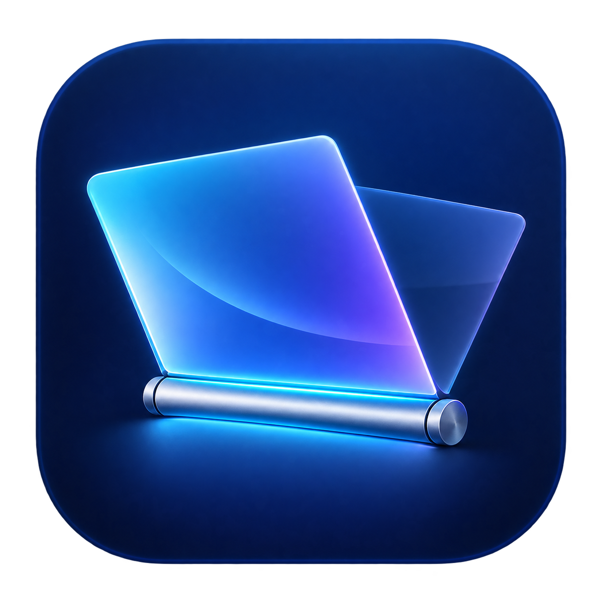
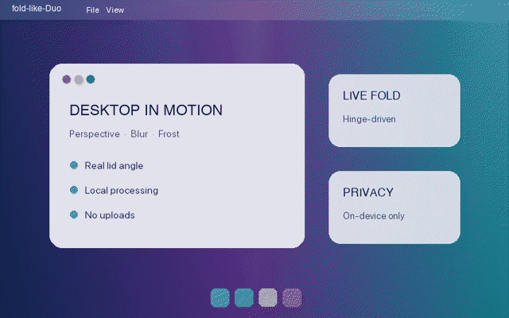

<p align="center">
  
</p>

# fold-like-Duo

简体中文 | [English](README.md)

fold-like-Duo 是一款原生 macOS 菜单栏应用，让桌面画面跟随 MacBook 屏幕开合。
它读取真实铰链角度，通过 Metal 渲染透视、模糊、磨砂和阴影效果。

应用内置简体中文和英文，不依赖第三方软件包。

<p align="center">
  
</p>

## 功能

- 通过 IOKit HID 读取真实 MacBook 铰链角度。
- 使用 ScreenCaptureKit 捕获本地桌面，并排除自身覆盖层。
- 屏幕停止移动时，特效保持在当前角度。
- 重新打开、传感器断开、休眠或显示器变化时安全清除特效。
- 提供无需权限的示例预览，以及 `⌘⇧Esc` 紧急暂停快捷键。
- 构建为同时支持 Apple 芯片和 Intel 的 Universal 2 应用。

## 系统要求

- macOS 14 Sonoma 或更高版本
- Apple 芯片或 Intel 处理器；发布包为 Universal 2 应用
- 自动特效需要能够读取 Apple 铰链角度传感器的 MacBook；当前识别
  `VID 0x05AC`、`PID 0x8104`，应用会在运行时检测兼容性
- 部分 M1/M2 Touch Bar 机型可能无法通过当前 HID 接口读取角度；不兼容时仍可使用示例预览
- 特效仅作用于 MacBook 内建显示器，不处理外接显示器
- 需要支持 Metal 的 GPU
- 实时特效需要屏幕录制权限
- 从源码构建需要 Xcode 15 或相应版本的 Xcode Command Line Tools

## 安装与首次打开

1. 下载并打开 DMG，将 `fold-like-Duo.app` 拖入“应用程序”文件夹。
2. 在“应用程序”中打开 fold-like-Duo。
3. 当前公开构建未经过 Apple 公证。如果 macOS 提示“无法验证开发者”或阻止打开，
   请打开“系统设置 → 隐私与安全性”，向下滚动到“安全性”，在 fold-like-Duo
   的提示旁点击“仍要打开”。
4. 使用 Touch ID 或登录密码确认，然后在最后的确认窗口中点击“打开”。

以上操作通常只需进行一次。请只打开从本项目官方 GitHub Releases 页面下载的版本。

## 构建

```sh
./test.sh       # 构建并运行检查
./package.sh    # 生成 dist/fold-like-Duo-1.0.0.dmg
```

默认使用临时签名。使用 Developer ID 分发时：

```sh
SIGNING_IDENTITY='Developer ID Application: Name (TEAMID)' ./package.sh
```

Developer ID 版本还需要使用发布者自己的 Apple Developer 凭据进行公证。

## 隐私

fold-like-Duo 只使用屏幕录制权限将实时桌面渲染为折叠表面。画面仅保存在内存中，
不会被保存或上传。应用不捕获音频和鼠标指针，也没有网络功能。

首次启动时，应用会主动请求 macOS 显示屏幕录制授权弹窗。如果之前已经拒绝，
macOS 不会再次显示系统弹窗，此时需要点击应用中的“打开隐私设置”进行恢复。

登录时启动是可选功能。读取内建铰链传感器和注册紧急快捷键不需要额外的隐私权限。

## 项目结构

```text
Sources/       Swift、AppKit、SwiftUI、ScreenCaptureKit 和 Metal 实现
Resources/     Metal 着色器、图标和本地化资源
build.sh       Universal 应用构建脚本
package.sh     拖放安装式 DMG 打包脚本
test.sh        应用包、本地化、签名和行为检查
```

## 许可证

项目采用 MIT 许可证。设计过程中研究的开源项目见 [NOTICE.md](NOTICE.md)。
fold-like-Duo 与 Apple 没有关联。
